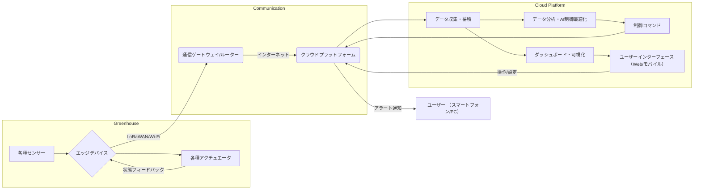
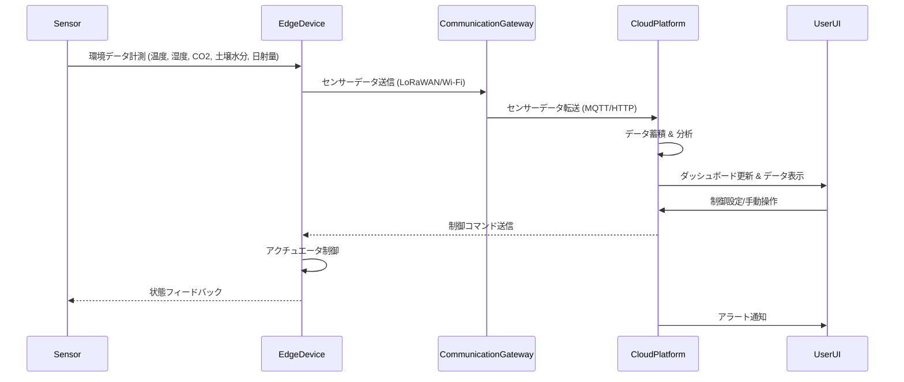

# 020_SYP2_システム・アーキテクチャ設計

## スマートグリーンハウスシステムの全体アーキテクチャ概要

### 2.1 システムの構成要素
スマートグリーンハウスシステムは、主に以下の3つの主要な構成要素から成り立ちます。

1.  **エッジデバイス**: グリーンハウス内に配置され、センサーデータ収集とアクチュエータ制御を行います。
2.  **通信インフラ**: エッジデバイスとクラウド間のデータ送受信を担います。LoRaWANまたはWi-Fiを利用します。
3.  **クラウドプラットフォーム**: データの蓄積、分析、可視化、AIによる制御最適化、およびユーザーインターフェースを提供します。

### 2.2 全体アーキテクチャ
システムの全体アーキテクチャは以下の図に示す通りです。

#### 2.2.1 エッジデバイス
エッジデバイスは、グリーンハウス内の環境データを収集し、クラウドからの制御コマンドに基づいてアクチュエータを操作する役割を担います。センサーは温度、湿度、CO2、土壌水分、日射量を計測し、アクチュエータは換気窓、ミスト、灌水、暖房、照明を制御します。LoRaWANまたはWi-Fiを介して通信ゲートウェイに接続されます。

#### 2.2.2 通信インフラ
通信インフラは、エッジデバイスとクラウドプラットフォーム間のデータ連携を実現します。プロジェクトの要件に応じて、長距離・低消費電力のLoRaWAN、または広帯域・短距離のWi-Fiが選択されます。通信ゲートウェイ/ルーターは、エッジデバイスからのデータを受け取り、インターネット経由でクラウドプラットフォームへ転送します。

#### 2.2.3 クラウドプラットフォーム
クラウドプラットフォームは、以下の機能を提供します。

*   **データ収集・蓄積**: エッジデバイスから送られてくるセンサーデータをリアルタイムで収集し、時系列データベースに蓄積します。
*   **データ分析・AI制御最適化**: 蓄積されたデータに基づき、環境データの傾向分析、異常検知、およびAIによる最適な環境制御パラメータの算出を行います。将来的にAIによる最適化機能が追加されます。
*   **ダッシュボード・可視化**: 収集されたセンサーデータや分析結果を、Webまたはモバイルアプリケーションのダッシュボードを通じて視覚的に表示します。これにより、ユーザーはグリーンハウスの現在の状況や過去の履歴を一目で把握できます。
*   **制御コマンド**: AI制御最適化の結果やユーザーからの手動操作に基づいて、エッジデバイスに制御コマンドを送信します。
*   **ユーザーインターフェース**: Webブラウザやスマートフォンアプリを通じて、システムの監視、設定変更、手動制御、アラートの確認などを行います。
*   **アラート通知**: 異常な環境条件やデバイスの故障を検知した場合、事前に設定された方法（メール、プッシュ通知など）でユーザーに通知します。

### 2.3 データフロー

### 2.4 技術スタック（案）

| カテゴリ | 技術要素（例） | 備考 |
|----------|----------------|------|
| エッジデバイス | ESP32, Raspberry Pi, Arduino | センサー/アクチュエータ接続、通信モジュール搭載 |
| 通信プロトコル | LoRaWAN, Wi-Fi | 通信方式に応じて選択 |
| クラウドプラットフォーム | AWS IoT Core, Azure IoT Hub, Google Cloud IoT Core | IoTデバイス連携、データインジェスト |
| データベース | TimescaleDB, InfluxDB, PostgreSQL | 時系列データに適したデータベース |
| データ処理 | AWS Lambda, Azure Functions, Google Cloud Functions | サーバーレスでのデータ処理・分析 |
| ダッシュボード | Grafana, Power BI, 自社開発Webアプリ | データの可視化、ユーザーインターフェース |
| AI/ML | TensorFlow, PyTorch, AWS SageMaker | 環境制御最適化モデルの学習・推論 |
| 通知 | AWS SNS, Twilio, SendGrid | アラート通知サービス |

### 2.5 今後の課題と検討事項

*   **AI機能の具体化**: AIによる環境制御最適化のアルゴリズム、学習データの収集方法、モデルのデプロイ・運用方法について詳細を検討する必要があります。
*   **セキュリティ**: デバイス認証、データ暗号化、アクセス制御など、システム全体のセキュリティ対策を具体的に設計する必要があります。
*   **スケーラビリティ**: 中規模グリーンハウスを対象としていますが、将来的な拡張性（大規模化、複数ハウス管理）も考慮したアーキテクチャを検討する必要があります。
*   **オフライン時の挙動**: 通信が途絶した場合のエッジデバイスの自律制御やデータ保持戦略を検討する必要があります。

