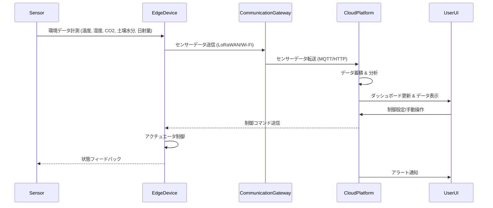

**文書名**
【SY205システム・アーキテクチャ設計書】

**文書番号**
SY205-001

| **承認** | **作成** |
|:--------:|:--------:|
| 承認者名 | 作成者名 |
|  承認日  |  作成日  |

**発行部署**
開発部

**発行日**
2026/05/24

---

**改訂履歴**

| **項番** | **日付** | **バージョン** | **改訂内容** | **備考** |
|----------|:--------:|----------------|--------------|----------|
| 1        | 2026/05/24 | 1.0.0          | 新規作成     |          |

---

**目　　次**

[**1** **概要**](#概要)

[**1.1** **目的**](#目的)

[**1.2** **位置づけ**](#位置づけ)

[**1.3** **対象ユーザ**](#対象ユーザ)

[**1.4** **記載範囲**](#記載範囲)

[**1.5** **参照ドキュメント**](#参照ドキュメント)

[**1.6** **定義（用語、略語）**](#定義（用語、略語）)

[**2** **システム構成**](#システム構成)

[**2.1** **システム全体構成**](#システム全体構成)

[**3** **機能ブロック概要**](#機能ブロック概要)

[**3.1** **システムを構成する機能ブロック**](#システムを構成する機能ブロック)

[**3.2** **機能ブロック間のインタフェース**](#機能ブロック間のインタフェース)

[**4** **制御方式**](#制御方式)

[**4.1** **動作シーケンス**](#動作シーケンス)

[**4.2** **ユースケースと機能ブロックの対応**](#ユースケースと機能ブロックの対応)

[**4.3** **性能見積**](#性能見積)

[**5** **機能ブロック詳細**](#機能ブロック詳細)

[**6** **システムで扱うデータ**](#システムで扱うデータ)

[**7** **例外一覧**](#例外一覧)

[**8** **その他**](#その他)

---

# **1 概要**

## **1.1 目的**
このドキュメントは、スマートグリーンハウスシステムのシステムアーキテクチャを定義することを目的としています。主要な構成要素、それらの間の関係、およびシステム全体の設計原則を記述します。

## **1.2 位置づけ**
本設計書は、「010_SYP1_システム要求定義/SY106_システム要求仕様書.md」で定義されたシステム要求を基に、より詳細なシステム構成と動作を設計するものです。以降のソフトウェア設計の基盤となります。

## **1.3 対象ユーザ**
本ドキュメントの対象読者は、システム開発者、プロジェクトマネージャー、およびシステムの関係者です。

## **1.4 記載範囲**
本ドキュメントでは、スマートグリーンハウスシステムの全体アーキテクチャ、主要な構成要素（エッジデバイス、通信インフラ、クラウドプラットフォーム）、各構成要素の概要、データフロー、および技術スタック（案）について記述します。個々の機能ブロックの詳細設計は、別途「050_SWP3_ソフトウェア詳細設計/SW305_ソフトウェア詳細設計書.md」にて定義されます。

## **1.5 参照ドキュメント**

| **ID** | **文書名**                     | **文書番号** | **発行年月** | **備考** |
|--------|--------------------------------|--------------|--------------|----------|
| SY106  | システム要求仕様書             | SY106-001    | 2026/05      |          |

## **1.6 定義（用語、略語）**

| **ID** | **用語・略号** | **正式表記** | **意味**                                             |
|--------|----------------|--------------|------------------------------------------------------|
| LoRaWAN| LoRaWAN        | Long Range Wide Area Network | 低電力広域通信技術の一種。IoTデバイスの通信に利用。       |
| MQTT   | MQTT           | Message Queuing Telemetry Transport | 軽量なメッセージングプロトコル。IoTデバイスのデータ送信に利用。|
| CoAP   | CoAP           | Constrained Application Protocol | 制約のあるデバイス向けのWeb転送プロトコル。              |

# **2 システム構成**

## **2.1 システム全体構成**
スマートグリーンハウスシステムは、主に以下の3つの主要な構成要素から成り立ちます。

1.  **エッジデバイス**: グリーンハウス内に配置され、センサーデータ収集とアクチュエータ制御を行います。
2.  **通信インフラ**: エッジデバイスとクラウド間のデータ送受信を担います。LoRaWANまたはWi-Fiを利用します。
3.  **クラウドプラットフォーム**: データの蓄積、分析、可視化、AIによる制御最適化、およびユーザーインターフェースを提供します。

システムの全体アーキテクチャは以下の図に示す通りです。

```mermaid
graph LR
    subgraph Greenhouse
        A[各種センサー] --> B{エッジデバイス}; 
        B --> C[各種アクチュエータ];
    end

    subgraph Communication
        B --> |LoRaWAN/Wi-Fi| D(通信ゲートウェイ/ルーター);
        D --> |インターネット| E(クラウドプラットフォーム);
    end

    subgraph Cloud Platform
        E --> F[データ収集・蓄積];
        F --> G[データ分析・AI制御最適化];
        F --> H[ダッシュボード・可視化];
        G --> J[制御コマンド];
        H --> K[ユーザーインターフェース (Web/モバイル)];
        J --> E;
    end
    K --> |操作/設定| E;
    E --> |アラート通知| L[ユーザー (スマートフォン/PC)];
    C --> |状態フィードバック| B;
```
図 1　システム全体構成図

エッジデバイスは、グリーンハウス内の環境データを収集し、クラウドからの制御コマンドに基づいてアクチュエータを操作する役割を担います。センサーは温度、湿度、CO2、土壌水分、日射量を計測し、アクチュエータは換気窓、ミスト、灌水、暖房、照明を制御します。LoRaWANまたはWi-Fiを介して通信ゲートウェイに接続されます。

通信インフラは、エッジデバイスとクラウドプラットフォーム間のデータ連携を実現します。プロジェクトの要件に応じて、長距離・低消費電力のLoRaWAN、または広帯域・短距離のWi-Fiが選択されます。通信ゲートウェイ/ルーターは、エッジデバイスからのデータを受け取り、インターネット経由でクラウドプラットフォームへ転送します。

クラウドプラットフォームは、以下の機能を提供します。

*   **データ収集・蓄積**: エッジデバイスから送られてくるセンサーデータをリアルタイムで収集し、時系列データベースに蓄積します。
*   **データ分析・AI制御最適化**: 蓄積されたデータに基づき、環境データの傾向分析、異常検知、およびAIによる最適な環境制御パラメータの算出を行います。将来的にAIによる最適化機能が追加されます。
*   **ダッシュボード・可視化**: 収集されたセンサーデータや分析結果を、Webまたはモバイルアプリケーションのダッシュボードを通じて視覚的に表示します。これにより、ユーザーはグリーンハウスの現在の状況や過去の履歴を一目で把握できます。
*   **制御コマンド**: AI制御最適化の結果やユーザーからの手動操作に基づいて、エッジデバイスに制御コマンドを送信します。
*   **ユーザーインターフェース**: Webブラウザやスマートフォンアプリを通じて、システムの監視、設定変更、手動制御、アラートの確認などを行います。
*   **アラート通知**: 異常な環境条件やデバイスの故障を検知した場合、事前に設定された方法（メール、プッシュ通知など）でユーザーに通知します。

# **3 機能ブロック概要**

## **3.1 システムを構成する機能ブロック**

| **機能ブロックID** | **機能ブロック名** | **機能概要** | **役割分担** | **関連機能ID** |
|----|----|----|----|----|
| ED01 | センサー管理 | 各種センサーから環境データを収集 | エッジデバイス | CL01 |
| ED02 | アクチュエータ制御 | クラウドからのコマンドに基づきアクチュエータを操作 | エッジデバイス | CL03 |
| CM01 | 通信ゲートウェイ | エッジデバイスとクラウド間のデータ送受信 | 通信インフラ | ED01, CL01 |
| CL01 | データ収集・蓄積 | センサーデータをリアルタイムで収集し、データベースに蓄積 | クラウドプラットフォーム | ED01, CL02, CL03, CL04 |
| CL02 | データ分析・AI制御最適化 | 環境データの分析、異常検知、AIによる最適な環境制御パラメータ算出 | クラウドプラットフォーム | CL01, CL03 |
| CL03 | ダッシュボード・可視化 | センサーデータや分析結果をWeb/モバイルで表示 | クラウドプラットフォーム | CL01, CL04 |
| CL04 | ユーザーインターフェース | システムの監視、設定変更、手動制御、アラート確認 | クラウドプラットフォーム | CL01, CL02, CL03, CL05 |
| CL05 | アラート通知 | 異常検知時にユーザーへ通知 | クラウドプラットフォーム | CL02 |

## **3.2 機能ブロック間のインタフェース**



# **4 制御方式**

## **4.1 動作シーケンス**
「3.2 機能ブロック間のインタフェース」のシーケンス図を参照してください。

## **4.2 ユースケースと機能ブロックの対応**
システム要求仕様書（SY106）で定義されたユースケースに基づき、各ユースケースがどの機能ブロックと対応するかを整理します。

| **ユースケースID** | **ユースケース名** | **関連機能ブロックID** |
|------------------|--------------------|------------------------|
| UC01             | 環境データ監視     | ED01, CM01, CL01, CL03, CL04 |
| UC02             | 環境自動制御       | ED01, ED02, CM01, CL01, CL02, CL03 |
| UC03             | 手動制御           | ED02, CM01, CL04 |
| UC04             | アラート通知       | CL02, CL05, CL04 |
| UC05             | システム設定       | CL04 |

## **4.3 性能見積**

| **項目**     | **見積値** | **備考**                                           |
|--------------|------------|----------------------------------------------------|
| センサーデータ送信頻度 | 1分に1回   | 全センサーデータ                                   |
| アクチュエータ制御応答時間 | 5秒以内    | 制御コマンド受信からアクチュエータ動作開始まで     |
| ダッシュボード更新頻度 | 10秒に1回  | 最新データ反映                                     |
| アラート通知遅延 | 1分以内    | 異常検知から通知まで                               |

# **5 機能ブロック詳細**
ここでは、各機能ブロックの入出力インタフェース、処理方式、共通領域などについて記述します。詳細は別途、ソフトウェア詳細設計書（SW305）で定義されます。

# **6 システムで扱うデータ**

| **データID** | **データ名**   | **概要**                   | **関連機能ブロックID** |
|--------------|----------------|----------------------------|------------------------|
| SD01         | 環境センサーデータ | 温度、湿度、CO2、土壌水分、日射量 | ED01, CL01, CL02, CL03 |
| SD02         | アクチュエータ状態 | 換気窓、ミスト、灌水、暖房、照明の開閉状態など | ED02, CL03 |
| SD03         | 制御コマンド     | アクチュエータへの操作指示 | CL02, ED02 |
| SD04         | ユーザー設定データ | 閾値、通知設定など         | CL04, CL02, CL05 |

# **7 例外一覧**

| **例外コード** | **例外内容**         | **対処方法**                     | **備考** |
|----------------|----------------------|----------------------------------|----------|
| EX001          | センサーデータ異常   | 異常値を無視、または補間処理     | ログ記録 |
| EX002          | 通信断             | 再試行、オフライン制御への移行   | アラート |
| EX003          | アクチュエータ故障   | 手動確認、予備アクチュエータへの切り替え | アラート |

# **8 その他**
今後の課題と検討事項

*   **AI機能の具体化**: AIによる環境制御最適化のアルゴリズム、学習データの収集方法、モデルのデプロイ・運用方法について詳細を検討する必要があります。
*   **セキュリティ**: デバイス認証、データ暗号化、アクセス制御など、システム全体のセキュリティ対策を具体的に設計する必要があります。
*   **スケーラビリティ**: 中規模グリーンハウスを対象としていますが、将来的な拡張性（大規模化、複数ハウス管理）も考慮したアーキテクチャを検討する必要があります。
*   **オフライン時の挙動**: 通信が途絶した場合のエッジデバイスの自律制御やデータ保持戦略を検討する必要があります。
