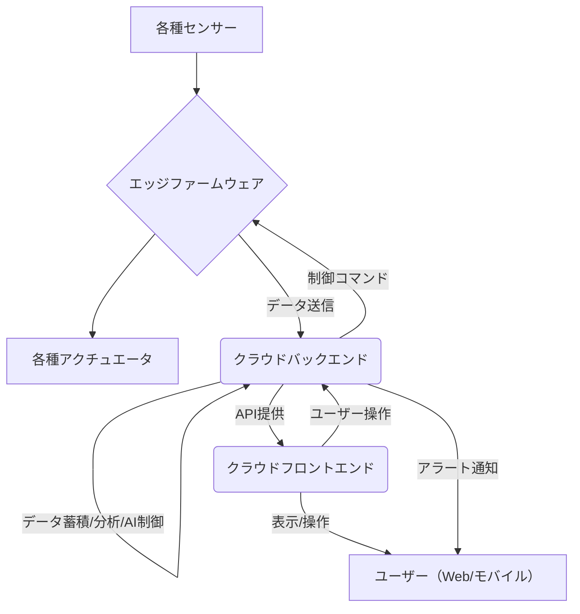

**文書名**
【SW105ソフトウェア要求仕様書】

**文書番号**

| **承認** | **作成** |
|:--------:|:--------:|
| 承認者名 | 作成者名 |
|  承認日  |  作成日  |

**発行部署**

**発行日**
2026/05/24

**改訂履歴**

| **項番** | **日付** | **バージョン** | **改訂内容** | **備考** |
|----------|:--------:|----------------|--------------|----------|
| 1        | 2026/05/24 | 1.0.0          | 新規作成       |          |

**目　　次**

[**1** **概要** [1](#概要)](#概要)

[**1.1** **目的** [1](#目的)](#目的)

[**1.2** **位置づけ** [1](#位置づけ)](#位置づけ)

[**1.3** **対象ユーザ** [1](#対象ユーザ)](#対象ユーザ)

[**1.4** **記載範囲** [1](#記載範囲)](#記載範囲)

[**1.5** **参照ドキュメント** [1](#参照ドキュメント)](#参照ドキュメント)

[**1.6** **定義（用語、略語）** [1](#定義用語略語)](#定義用語略語)

[**2** **システム構成** [2](#システム構成)](#システム構成)

[**2.1** **システム全体構成** [2](#システム全体構成)](#システム全体構成)

[**2.2** **システムを構成する主たる要素** [2](#システムを構成する主たる要素)](#システムを構成する主たる要素)

[**3** **機能概要** [3](#機能概要)](#機能概要)

[**4** **制約条件** [3](#制約条件)](#制約条件)

[**4.1** **ハードウェアなどを含めたシステム全体の構成と制約** [3](#ハードウェアなどを含めたシステム全体の構成と制約)](#ハードウェアなどを含めたシステム全体の構成と制約)

[**4.2** **ソフトウェアプラットフォーム** [3](#ソフトウェアプラットフォーム)](#ソフトウェアプラットフォーム)

[**5** **ユースケースとユースケース・シナリオ** [4](#ユースケースとユースケースシナリオ)](#ユースケースとユースケースシナリオ)

[**6** **機能詳細** [4](#機能詳細)](#機能詳細)

[**7** **インタフェース詳細** [4](#インタフェース詳細)](#インタフェース詳細)

[**8** **性能・品質等非機能要求詳細** [5](#性能品質等非機能要求詳細)](#性能品質等非機能要求詳細)

[**8.1** **信頼性に関する要求** [5](#信頼性に関する要求)](#信頼性に関する要求)

[**8.2** **使用性に関する要求** [5](#使用性に関する要求)](#使用性に関する要求)

[**8.3** **効率性に関する要求** [5](#効率性に関する要求)](#効率性に関する要求)

[**8.4** **保守性・移植性に関する要求** [5](#保守性移植性に関する要求)](#保守性移植性に関する要求)

[**8.5** **セキュリティ面に関する要求** [5](#セキュリティ面に関する要求)](#セキュリティ面に関する要求)

[**9** **その他** [5](#その他)](#その他)

# **概要**

## **目的**
本ソフトウェア要求仕様書は、「スマートグリーンハウスIoTシステム」において開発されるソフトウェアに関する全ての要求事項を詳細に定義することを目的とします。これにより、ソフトウェア開発チームと関係者間での共通認識を確立し、高品質なソフトウェアが効率的に開発されることを保証します。

## **位置づけ**

## **対象ユーザ**

## **記載範囲**
本仕様書は、ソフトウェアの機能要件、非機能要件、インターフェース要件、およびデータ要件を網羅します。実装の詳細、特定のアルゴリズム、テストケースなどは、別途作成される詳細設計書やテスト仕様書に委ねられます。

## **参照ドキュメント**

| **ID** | **文書名** | **文書番号** | **発行年月** | **備考** |
|--------|------------|--------------|--------------|----------|
|        | [製品企画書](../000_製品企画書/製品企画書.md) |          |              |          |
|        | [システム要求仕様書](../010_SYP1_システム要求定義/SY106_システム要求仕様書.md) |          |              |          |
|        | [システムアーキテクチャ設計書](../020_SYP2_システム・アーキテクチャ設計/SY205_システムアーキテクチャ設計書.md) |          |              |          |
|        | [ソフトウェア要求仕様書](../030_SWP1_ソフトウェア要求定義/SW105_ソフトウェア要求仕様書.md) |          |              |          |

## **定義（用語、略語）**

| **ID** | **用語・略号** | **正式表記** | **意味** |
|--------|----------------|--------------|----------|
|        |                |              |          |

**システム構成**

## **システム全体構成**

<!--
＊ハードウェアとソフトウェアを含むシステム全体構成をブロック図などで整理し、ソフトウェアの位置づけを明確にする
-->
図 1　システム全体構成図

## **システムを構成する主たる要素**

| **構成要素ID** | **構成要素** | **概要** |
|----------------|--------------|----------|
| エッジファームウェア | エッジファームウェア | センサーデータの収集、アクチュエータ制御、通信処理を担当。 |
| クラウドバックエンド | クラウドバックエンド | データ収集、蓄積、分析、AI制御ロジック、API提供を担当。 |
| クラウドフロントエンド | クラウドフロントエンド | ユーザーインターフェース、ダッシュボード、遠隔操作機能を提供。 |

<!--
＊2.1、2.2はシステム・アーキテクチャ設計書から転記
-->

**機能概要**

<!--
＊ソフトウェアとして実現する機能の概要などを簡潔に整理する
-->
本システムのソフトウェアは、大きく分けて以下のコンポーネントから構成されます。

*   **エッジファームウェア**: センサーデータの収集、アクチュエータ制御、通信処理を担当。
*   **クラウドバックエンド**: データ収集、蓄積、分析、AI制御ロジック、API提供を担当。
*   **クラウドフロントエンド (Web/モバイル)**: ユーザーインターフェース、ダッシュボード、遠隔操作機能を提供。

# **制約条件**

## **ハードウェアなどを含めたシステム全体の構成と制約**

<!--
＊製品の動作環境、保守方法、準拠規約などの制約条件を整理する
-->

## **ソフトウェアプラットフォーム**

| **種類**             | **名称** | **バージョン** |
|----------------------|----------|----------------|
| 利用するOS           |          |                |
| 利用するミドルウェア |          |                |
| 言語                 | Python   |                |
| 言語                 | JavaScript |                |
| 言語                 | C/C++    |                |

**ユースケースとユースケース・シナリオ**

| **ユースケースID** | **ユースケース名** | **概要** |
|--------------------|--------------------|----------|
| SWR-FW-010 | センサーデータ読み取り機能 | 接続された温度、湿度、CO2、土壌水分、日射量センサーからデータをI2C、SPI、アナログ等のインターフェース経由で正確に読み取れること。 |
| SWR-FW-011 | アクチュエータ制御機能 | クラウドからのコマンドまたは自律制御ロジックに基づき、換気窓、ミスト、灌水、暖房、照明のアクチュエータをGPIO、PWM、リレー制御などで適切に操作できること。 |
| SWR-FW-012 | データ送信機能 | 読み取ったセンサーデータを指定された通信プロトコル（MQTTなど）でLoRaWANまたはWi-Fiモジュール経由でクラウドバックエンドに送信できること。 |
| SWR-FW-013 | 自律制御ロジック | 通信途絶時でも、事前に設定された閾値やルールに基づき、最低24時間は環境制御を継続できること。 |
| SWR-FW-014 | ファームウェア更新機能 | OTA (Over-The-Air) 方式または指定されたインターフェース経由で、ファームウェアをリモートで安全に更新できること。 |
| SWR-BE-010 | デバイス連携機能 | エッジデバイスからのデータ受信（MQTTなど）およびコマンド送信をセキュアに行えること。デバイス認証、通信暗号化をサポートすること。 |
| SWR-BE-011 | データ蓄積機能 | 受信したセンサーデータを時系列データベースに効率的かつ永続的に蓄積できること。 |
| SWR-BE-012 | データ検索・集計機能 | 蓄積されたデータに対し、指定された期間、デバイス、データ項目で検索・集計し、フロントエンドに提供できること。 |
| SWR-BE-013 | 閾値管理機能 | 各センサーデータに対する閾値を設定、変更、管理できること。 |
| SWR-BE-014 | 異常検知ロジック | 閾値管理機能で設定された閾値に基づき、異常な環境条件を検知できること。 |
| SWR-BE-015 | アラート通知連携機能 | 異常検知時に、外部通知サービス（メール、プッシュ通知など）と連携し、ユーザーにアラートを送信できること。 |
| SWR-BE-016 | 制御コマンド発行機能 | フロントエンドからの手動制御コマンドまたはAI制御ロジックからの最適化コマンドをエッジデバイスに発行できること。 |
| SWR-BE-017 | ユーザー認証・認可機能 | ユーザーのログイン認証、およびロールに基づいたAPIアクセス認可を行えること。 |
| SWR-BE-018 | AI制御ロジック連携機能（将来） | 学習済みAIモデルとの連携インターフェースを提供し、最適制御パラメータを受け取り、制御コマンドに変換できること。 |
| SWR-BE-019 | ログ管理機能 | システムの稼働状況、エラー、デバイスとの通信履歴などを記録・管理できること。 |
| SWR-FE-010 | ユーザーログイン機能 | 登録済みのユーザーがIDとパスワードを用いてセキュアにログインできること。 |
| SWR-FE-011 | ダッシュボード表示機能 | リアルタイムのセンサーデータ、アクチュエータの状態、アラート情報などを視覚的に分かりやすく表示できること。グラフや数値での表示に対応すること。 |
| SWR-FE-012 | 履歴データ表示機能 | 過去のセンサーデータやアクチュエータの動作履歴を、期間指定してグラフ表示できること。 |
| SWR-FE-013 | 手動制御インターフェース | 各アクチュエータに対し、手動でON/OFF操作や設定値の変更ができるインターフェースを提供すること。自動制御モードとの排他制御を考慮すること。 |
| SWR-FE-014 | 閾値設定インターフェース | 各センサーデータに対する閾値をユーザーが設定、変更できるインターフェースを提供すること。 |
| SWR-FE-015 | アラート履歴表示機能 | 発生したアラートの履歴を一覧表示し、詳細情報を確認できること。 |
| SWR-FE-016 | ユーザー管理機能 | 管理者権限を持つユーザーが、新規ユーザーの登録、権限変更、削除を行えること。 |
| SWR-FE-017 | レスポンシブデザイン | WebアプリケーションはPC、タブレット、スマートフォンなど、様々なデバイスの画面サイズに対応して表示できること。 |

<!--
＊システムを構成する機能ブロックごとにユーザとソフトウェアとしてのやりとりを考慮し、時系列的にその流れを整理する
-->

# **機能詳細**

<!--
＊ユースケースを実現する機能について整理する
-->

# **インタフェース詳細**

<!--
＊システム／ソフトウェアを構成する要素間のインタフェースを明確にする
＊ソフトウェア機能間のインタフェースを明確にする
＊システム構成要素間をつなぐデータなどに関する使用を明確にする
-->

## **エッジファームウェア - ハードウェアインターフェース**

| **ID** | **インターフェース名** | **概要** | **プロトコル/方式** | **備考** |
|----|--------------------|------|----------------|------|
| SWI-FW-010 | センサーデータ取得I/F | 各種センサーからのデータ取得 | I2C, SPI, Analog, UART | センサーの種類に応じる |
| SWI-FW-011 | アクチュエータ制御I/F | 各種アクチュエータへの制御信号出力 | GPIO, PWM, Relay制御 | アクチュエータの種類に応じる |
| SWI-FW-012 | 通信モジュールI/F | LoRaWAN/Wi-Fiモジュールとの通信 | UART, SPI | モジュールに応じる |

## **エッジファームウェア - クラウドバックエンドインターフェース**

| **ID** | **インターフェース名** | **概要** | **プロトコル** | **備考** |
|----|--------------------|------|------------|------|
| SWI-BC-010 | センサーデータ送信I/F | エッジデバイスからクラウドバックエンドへのセンサーデータ送信 | MQTT/S, HTTP/S | JSON形式でデータを送信 |
| SWI-BC-011 | 制御コマンド受信I/F | クラウドバックエンドからエッジデバイスへの制御コマンド受信 | MQTT/S, HTTP/S | JSON形式でコマンドを受信 |
| SWI-BC-012 | デバイス状態通知I/F | エッジデバイスからクラウドバックエンドへの状態（オンライン/オフライン、エラーなど）通知 | MQTT/S | | 

## **クラウドバックエンド - クラウドフロントエンドインターフェース**

| **ID** | **インターフェース名** | **概要** | **プロトコル** | **備考** |
|----|--------------------|------|------------|------|
| SWI-FE-010 | データ取得API | フロントエンドがセンサーデータ、アクチュエータ状態などを取得 | REST API (HTTP/S) | JSON形式でデータを返却 |
| SWI-FE-011 | 制御コマンド送信API | フロントエンドが手動制御コマンドなどをバックエンドに送信 | REST API (HTTP/S) | JSON形式でコマンドを送信 |
| SWI-FE-012 | 設定管理API | フロントエンドが閾値、ユーザー設定などを取得・更新 | REST API (HTTP/S) | JSON形式でデータを管理 |
| SWI-FE-013 | 認証・認可API | フロントエンドがユーザー認証、権限確認などを行う | REST API (HTTP/S) | JWTなどを用いて認証情報を管理 |

## **クラウドバックエンド - AI制御モジュールインターフェース（将来）**

| **ID** | **インターフェース名** | **概要** | **プロトコル** | **備考** |
|----|--------------------|------|------------|------|
| SWI-AI-010 | 学習データ提供I/F | バックエンドからAI制御モジュールへ学習データ提供 | REST API / Batch | 履歴データ、栽培履歴など |
| SWI-AI-011 | 最適制御パラメータ取得I/F | AI制御モジュールからバックエンドへ最適制御パラメータ提供 | REST API | 推論結果をJSON形式で返却 |

### **データ要件 (ソフトウェア単位)**

#### **エッジファームウェア内部データ**

| **データ項目名** | **型** | **単位** | **備考** |
|--------------|----|------|------|
| センサーバッファ | 配列 | - | 最新のセンサーデータを一時的に保持 |
| 制御設定値 | Struct | - | 目標温度、湿度などの現在の制御設定 |
| デバイス設定 | JSON | - | 通信設定、IDなどのデバイス固有設定 |

#### **クラウドバックエンドデータモデル**

| **データ項目名** | **型** | **備考** |
|--------------|----|------|
| センサーデータ | 時系列データ | デバイスID, タイムスタンプ, 温度, 湿度, CO2, 土壌水分, 日射量 |
| アクチュエータ状態 | 時系列データ | デバイスID, タイムスタンプ, 換気窓, ミスト, 灌水, 暖房, 照明の状態 |
| 制御履歴 | 時系列データ | デバイスID, タイムスタンプ, 制御コマンド, 実行結果 |
| 閾値設定 | ドキュメント | センサー種別, 最小値, 最大値, 単位, 適用デバイス |
| ユーザー情報 | ドキュメント | ユーザーID, パスワードハッシュ, ロール, メールアドレス |
| デバイス情報 | ドキュメント | デバイスID, デバイス名, 設置場所, 接続状態, ファームウェアバージョン |
| アラート情報 | 時系列データ | アラートID, タイムスタンプ, デバイスID, センサー種別, 閾値, 実際の値, 状態 |
| AIモデルパラメータ | ドキュメント | 学習済みAIモデルのパラメータ（将来） |

### **ソフトウェア標準・規約**

#### **コーディング規約**

| **項目** | **規約内容** |
|------|----------|
| 言語 | Python (バックエンド, AI), JavaScript (フロントエンド), C/C++ (ファームウェア) |
| フォーマット | 各言語の標準フォーマッター (例: Black for Python, Prettier for JavaScript) を使用し、自動整形を徹底する。 |
| コメント | 複雑なロジックや非自明な処理には必ずコメントを付与する。外部公開APIにはJSDoc/Sphinx形式のドキュメントコメントを記述する。 |
| 変数名 | 意味が明確で、小文字のスネークケース (snake_case) またはキャメルケース (camelCase) を使用する。 |
| 関数名 | 意味が明確で、動詞から始まるスネークケースまたはキャメルケースを使用する。 |
| クラス名 | 意味が明確で、パスカルケース (PascalCase) を使用する。 |

#### **バージョン管理規約**

| **項目** | **規約内容** |
|------|----------|
| システム | Git を使用する。 |
| ブランチ戦略 | Git Flow または Trunk Based Development を採用する。 |
| コミットメッセージ | 簡潔かつ分かりやすく、変更内容を明確に記述する。 Conventional Commits に準拠することを推奨する。 |
| リリース | Semantic Versioning (セマンティックバージョニング) に準拠する。 |

#### **テスト規約**

| **項目** | **規約内容** |
|------|----------|
| 単位テスト | 全ての重要な関数、メソッド、コンポーネントに対し、適切な単位テストを記述すること。カバレッジ目標を定める。 |
| 結合テスト | コンポーネント間の連携を確認する結合テストを実施すること。 |
| 総合テスト | システム全体が要件を満たしているかを確認する総合テストを実施すること。 |
| 自動化 | 可能な限りテストを自動化し、CI/CDパイプラインに組み込むこと。 |
