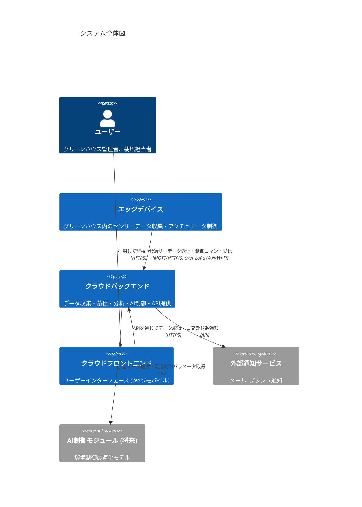
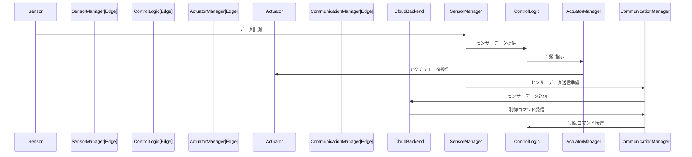
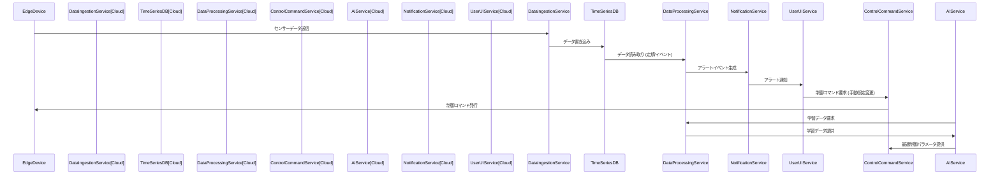
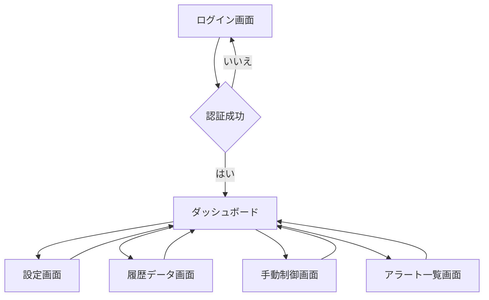

# 040_SWP2_ソフトウェア・アーキテクチャ設計

## SW205_ソフトウェアアーキテクチャ設計書

### 1. はじめに

#### 1.1 文書の目的
本ソフトウェアアーキテクチャ設計書は、「スマートグリーンハウスIoTシステム」のソフトウェアコンポーネントの構造、相互関係、および主要な設計決定を明確に記述することを目的とします。これにより、ソフトウェア開発のガイドラインを提供し、システムの拡張性、保守性、信頼性を確保します。

#### 1.2 対象範囲
本設計書は、以下の主要なソフトウェアコンポーネントを対象とします。

*   エッジデバイスファームウェア
*   クラウドバックエンドシステム
*   クラウドフロントエンドシステム (Web/モバイルアプリケーション)

#### 1.3 参照文書
*   [000_製品企画書/製品企画書.md](../000_製品企画書/製品企画書.md)
*   [010_SYP1_システム要求定義/SY106_システム要求仕様書.md](../010_SYP1_システム要求定義/SY106_システム要求仕様書.md)
*   [020_SYP2_システム・アーキテクチャ設計/SY205_システムアーキテクチャ設計書.md](../020_SYP2_システム・アーキテクチャ設計/SY205_システムアーキテクチャ設計書.md)
*   [030_SWP1_ソフトウェア要求定義/SW105_ソフトウェア要求仕様書.md](../030_SWP1_ソフトウェア要求定義/SW105_ソフトウェア要求仕様書.md)

### 2. 全体ソフトウェアアーキテクチャ

#### 2.1 ソフトウェアコンポーネント図
システムの主要なソフトウェアコンポーネントとその相互作用を以下の図に示します。



#### 2.2 ソフトウェア層構成
各主要コンポーネントは、以下の論理的な層構造に基づいて設計されます。これにより、関心事の分離 (Separation of Concerns) を実現し、保守性と拡張性を高めます。

```mermaid
C4Container
    title エッジデバイスのコンテナ図

    System_Boundary(edge_device_boundary, "エッジデバイス") {
        Container(sensor_driver, "センサー駆動層", "C/C++", "センサーからのデータ読み取り")
        Container(actuator_driver, "アクチュエータ駆動層", "C/C++", "アクチュエータへの制御信号出力")
        Container(communication_manager, "通信管理層", "C/C++", "LoRaWAN/Wi-Fi通信モジュールとの連携")
        Container(control_logic, "制御ロジック層", "C/C++", "自律制御、クラウドコマンド解釈・実行")
        Container(data_manager, "データ管理層", "C/C++", "センサーデータの一時バッファリング、設定値保持")
    }

    Rel(sensor_driver, data_manager, "データ提供")
    Rel(control_logic, sensor_driver, "データ要求")
    Rel(control_logic, actuator_driver, "制御命令")
    Rel(data_manager, communication_manager, "データ送信")
    Rel(communication_manager, control_logic, "コマンド受信")

    System_Boundary(cloud_platform_boundary, "クラウドプラットフォーム") {
        Container(data_ingestion_service, "データ収集サービス", "Python", "エッジデバイスからのデータ受信・認証")
        Container(timeseries_database, "時系列データベース", "Managed DB", "センサーデータの永続化")
        Container(data_processing_service, "データ処理サービス", "Python", "異常検知、データ集計・分析")
        Container(api_gateway, "APIゲートウェイ", "Managed Service", "フロントエンドからのAPIリクエストルーティング・認証")
        Container(user_service, "ユーザー管理サービス", "Python", "ユーザー認証・認可・プロファイル管理")
        Container(control_command_service, "制御コマンドサービス", "Python", "エッジデバイスへのコマンド発行、手動制御ロジック")
        Container(dashboard_service, "ダッシュボードサービス", "JavaScript/TypeScript", "データ可視化、UI提供")
        Container(notification_service_internal, "通知サービス", "Python", "アラート生成、外部通知サービス連携")
        Container(ai_integration_service, "AI連携サービス (将来)", "Python", "AI制御モジュールとのデータ・パラメータ連携")
    }

    Rel(data_ingestion_service, timeseries_database, "データ書き込み")
    Rel(data_processing_service, timeseries_database, "データ読み書き")
    Rel(data_processing_service, notification_service_internal, "アラート生成")
    Rel(api_gateway, user_service, "ユーザー認証")
    Rel(api_gateway, data_processing_service, "データ要求")
    Rel(api_gateway, control_command_service, "制御要求")
    Rel(api_gateway, dashboard_service, "UIコンテンツ提供")
    Rel(control_command_service, edge_device_boundary, "制御コマンド送信")
    Rel(notification_service_internal, notification_service, "外部通知")
    Rel(ai_integration_service, data_processing_service, "データ要求")
    Rel(ai_integration_service, control_command_service, "最適制御パラメータ提供")
```

### 3. 各ソフトウェアコンポーネント詳細設計

#### 3.1 エッジデバイスファームウェア

##### 3.1.1 構成要素
*   **ハードウェア抽象化層 (HAL)**: センサー、アクチュエータ、通信モジュールなどのハードウェアリソースを抽象化し、上位層に共通インターフェースを提供します。
*   **センサー管理モジュール**: 各種センサーからデータを周期的に取得し、生データを整形します。
*   **アクチュエータ制御モジュール**: 制御コマンドに応じて、対応するアクチュエータを操作します。安全確保のため、排他制御やフェイルセーフ機構を考慮します。
*   **通信モジュール**: LoRaWANまたはWi-Fiモジュールを介してクラウドバックエンドとのデータ送受信を担います。再送処理やエラーハンドリングを実装します。
*   **制御ロジックモジュール**: 収集されたセンサーデータとクラウドからの設定値に基づき、環境制御の判断を行います。通信途絶時には、直前の設定値に基づいた自律制御に切り替わります。
*   **データバッファモジュール**: センサーデータや制御設定値を一時的に保持します。通信障害時の一時的なデータ保持にも利用します。

##### 3.1.2 データフロー (エッジデバイス内)


#### 3.2 クラウドバックエンドシステム

##### 3.2.1 構成要素
*   **APIゲートウェイ**: 全ての外部からのAPIリクエストを受け付け、認証・認可を行い、適切なバックエンドサービスにルーティングします。
*   **データインジェストサービス**: エッジデバイスからのセンサーデータを受け取り、初期検証と前処理を行い、時系列データベースに書き込みます。デバイス認証も担当します。
*   **時系列データベース**: センサーデータ、アクチュエータ履歴、制御履歴などを効率的に格納・検索するためのデータベースです。
*   **データ処理サービス**: 蓄積されたデータに対し、異常検知、集計、統計分析などを実行します。AI連携のためのデータ整形も行います。
*   **ユーザー管理サービス**: ユーザー情報、認証、認可ロジックを管理します。
*   **制御コマンドサービス**: 手動制御リクエストやAI制御ロジックからの指示を受け、エッジデバイスへ制御コマンドを発行します。デバイスツインの状態管理も行います。
*   **通知サービス**: 異常検知イベントなどに基づき、メールやプッシュ通知を外部通知サービスと連携して送信します。
*   **AI連携サービス（将来）**: AI制御モジュールとのインターフェースを提供し、学習データの提供と最適制御パラメータの取得を行います。

##### 3.2.2 データフロー (クラウドバックエンド内)


#### 3.3 クラウドフロントエンドシステム (Web/モバイル)

##### 3.3.1 構成要素
*   **認証・認可モジュール**: ユーザーのログイン処理とAPIアクセス権限の管理を行います。
*   **ダッシュボードモジュール**: リアルタイムデータ、グラフ、アラートサマリーなどを表示します。
*   **設定管理モジュール**: 閾値設定、ユーザープロファイル、デバイス設定などの管理インターフェースを提供します。
*   **制御操作モジュール**: アクチュエータの手動制御インターフェースを提供します。
*   **APIクライアントモジュール**: クラウドバックエンドのAPIと通信し、データの取得やコマンドの送信を行います。
*   **通知表示モジュール**: アラート通知やシステムメッセージを表示します。

##### 3.3.2 画面遷移図（例）


### 4. 主要な設計上の決定事項

#### 4.1 通信プロトコル
*   **エッジ - クラウド間**: MQTT/Sを主とし、低帯域・非同期通信の要件を満たします。LoRaWANの場合はCoAPや軽量なカスタムプロトコルも検討します。信頼性向上のためQoSレベルを考慮します。
*   **クラウド - フロントエンド間**: RESTful API (HTTP/S) を標準とします。リアルタイム性が求められるダッシュボード更新にはWebSocketの利用も検討します。

#### 4.2 データ永続化
*   **センサーデータ**: 時系列データベース（例: TimescaleDB, InfluxDB）を採用し、大量の時系列データを効率的に保存・クエリできるようにします。
*   **設定・マスターデータ**: リレーショナルデータベース（例: PostgreSQL）またはNoSQLデータベース（例: DynamoDB, MongoDB）を採用し、ユーザー情報、デバイス情報、閾値設定などを管理します。

#### 4.3 認証・認可
*   **デバイス認証**: X.509証明書またはShared Key方式を用いて、各エッジデバイスの正当性を検証します。
*   **ユーザー認証**: JWT (JSON Web Token) ベースの認証メカニズムを採用し、ステートレスな認証を可能にします。OAuth 2.0フローを検討します。
*   **認可**: ロールベースアクセス制御 (RBAC) を導入し、ユーザーの役割に応じてアクセス可能な機能やデータ範囲を制限します。

#### 4.4 ソフトウェア言語・フレームワーク (推奨スタック)
| コンポーネント | 言語/フレームワーク | 備考 |
|----------------|--------------------|------|
| エッジファームウェア | C/C++ (PlatformIO/Arduinoフレームワーク) | マイクロコントローラ向けに最適化、効率的なリソース利用 |
| クラウドバックエンド | Python (FastAPI/Flask) | 迅速な開発、豊富なライブラリ、AI/ML連携の容易さ |
| クラウドフロントエンド | React/Vue.js (Web), React Native/Flutter (モバイル) | 豊富なUIコンポーネント、クロスプラットフォーム開発 |
| データベース | PostgreSQL (TimescaleDB拡張) | リレーショナルDBの安定性、時系列データ管理機能の拡張 |
| メッセージキュー | Kafka/RabbitMQ | スケーラブルなデータインジェスト、非同期処理 |

### 5. 今後の課題と検討事項

*   **具体的なデバイス選定**: エッジデバイスのMCU、通信モジュール、センサー、アクチュエータの具体的な選定。
*   **CI/CDパイプライン**: ソフトウェアの自動ビルド、テスト、デプロイメントのパイプライン構築。
*   **モニタリング・ロギング**: システム全体の健全性を監視し、問題発生時に迅速に対応するためのモニタリングおよびログ集約システムの設計。
*   **コスト最適化**: クラウドサービスの利用コストを考慮したアーキテクチャ設計と運用戦略。
*   **オフライン動作の強化**: エッジデバイスの自律制御ロジックのさらなる詳細化とテスト。