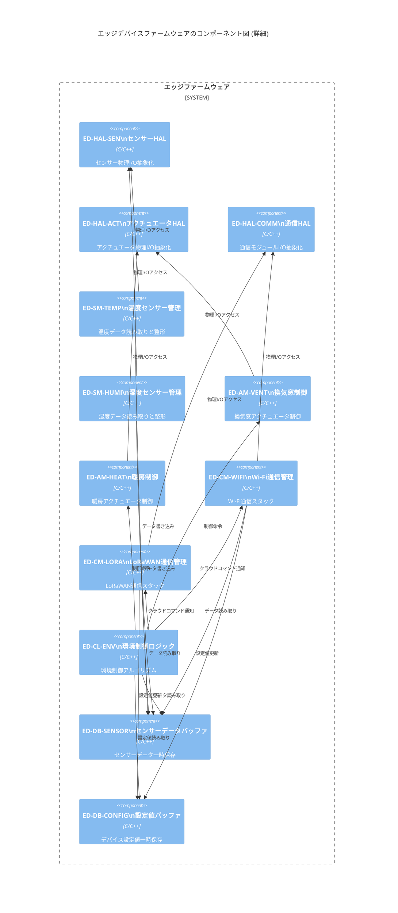
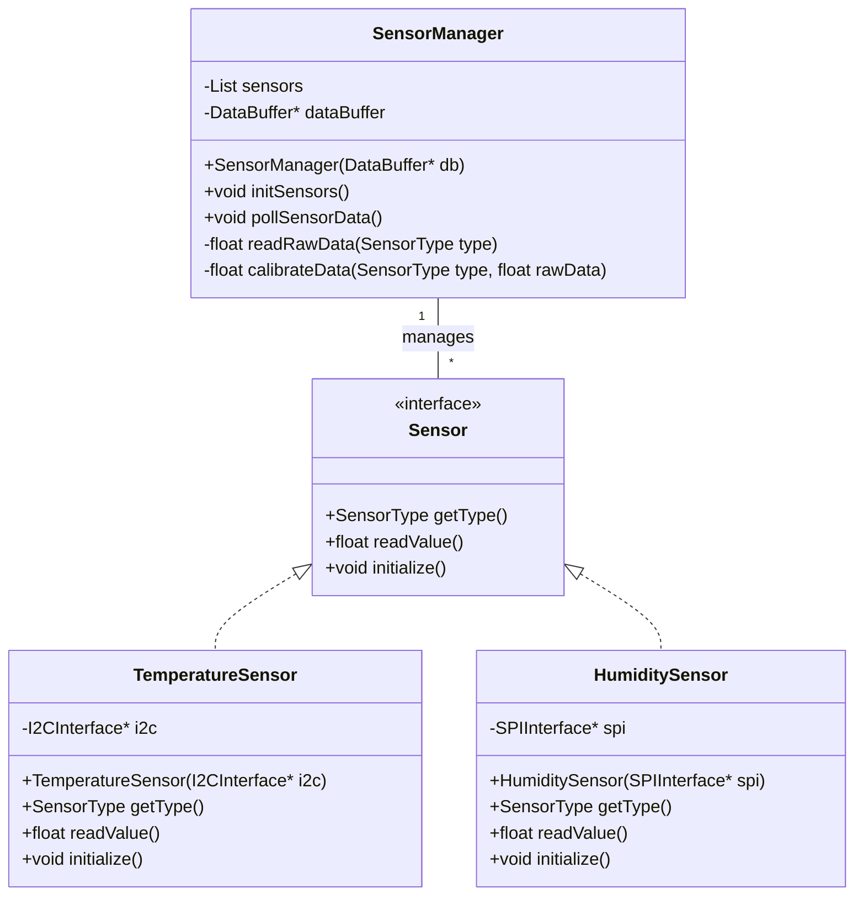
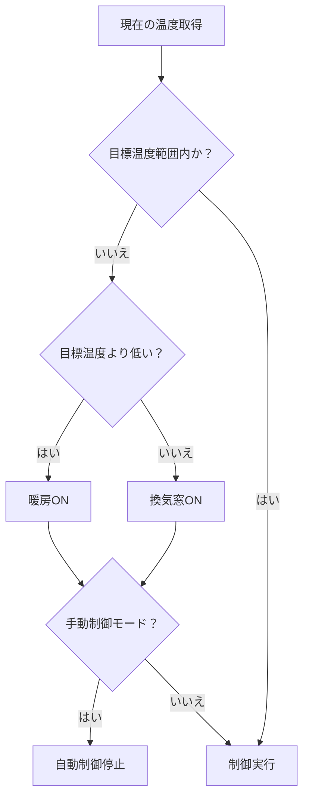

**文書名**
【SW305ソフトウェア詳細設計書】

**文書番号**

| **承認** | **作成** |
|:--------:|:--------:|
| 承認者名 | 作成者名 |
|  承認日  |  作成日  |

**発行部署**

**発行日**

**改訂履歴**

| **項番** | **日付** | **バージョン** | **改訂内容** | **備考** |
|----------|:--------:|----------------|--------------|----------|
|          |          |                |              |          |
|          |          |                |              |          |
|          |          |                |              |          |
|          |          |                |              |          |
|          |          |                |              |          |
|          |          |                |              |          |
|          |          |                |              |          |
|          |          |                |              |          |
|          |          |                |              |          |
|          |          |                |              |          |
|          |          |                |              |          |
|          |          |                |              |          |
|          |          |                |              |          |
|          |          |                |              |          |
|          |          |                |              |          |
|          |          |                |              |          |\n|          |          |                |              |          |
|          |          |                |              |          |
|          |          |                |              |          |
|          |          |                |              |          |
|          |          |                |              |          |
|          |          |                |              |          |
|          |          |                |              |          |
|          |          |                |              |          |
|          |          |                |              |          |
|          |          |                |              |          |
|          |          |                |              |          |
|          |          |                |              |          |
|          |          |                |              |          |
|          |          |                |              |          |

**目　　次**

[**1** **概要** [1](#概要)](#概要)

[**1.1** **目的** [1](#目的)](#目的)

[**1.2** **位置づけ** [1](#位置づけ)](#位置づけ)

[**1.3** **対象ユーザ** [1](#対象ユーザ)](#対象ユーザ)

[**1.4** **記載範囲** [1](#記載範囲)](#記載範囲)

[**1.5** **参照ドキュメント** [1](#参照ドキュメント)](#参照ドキュメント)

[**1.6** **定義（用語、略語）** [1](#定義用語略語)](#定義用語略語)

[**2** **プログラムユニット機能／構成設計書**
[2](#プログラムユニット機能構成設計書)](#プログラムユニット機能構成設計書)

[**2.1** **プログラムユニット一覧表**
[2](#プログラムユニット一覧表)](#プログラムユニット一覧表)

[**2.2** **プログラムユニット構成図**
[2](#プログラムユニット構成図)](#プログラムユニット構成図)

[**3** **プログラムユニット設計書**
[3](#プログラムユニット設計書)](#プログラムユニット設計書)

[**3.1** **プログラムユニット詳細処理**
[3](#プログラムユニット詳細処理)](#プログラムユニット詳細処理)

[**3.2** **状態管理** [4](#状態管理)](#状態管理)

[**3.3** **リソース定義** [4](#リソース定義)](#リソース定義)

[**3.4** **ハードウェア制御方法**
[4](#ハードウェア制御方法)](#ハードウェア制御方法)

[**3.5** **システム初期化処理**
[4](#システム初期化処理)](#システム初期化処理)

[**3.6** **共通定義** [4](#共通定義)](#共通定義)

[**4** **プログラムユニットインタフェース設計書**
[5](#プログラムユニットインタフェース設計書)](#プログラムユニットインタフェース設計書)

[**4.1** **シーケンス図** [5](#シーケンス図)](#シーケンス図)

[**4.2** **インタフェース詳細**
[6](#インタフェース詳細)](#インタフェース詳細)

[**5** **メモリ使用量** [7](#メモリ使用量)](#メモリ使用量)

[**6** **その他** [7](#その他)](#その他)

# **概要**

## **目的**
本ソフトウェア詳細設計書は、「スマートグリーンハウスIoTシステム」の各ソフトウェアコンポーネントにおける内部構造、クラス設計、モジュール間インターフェース、データ構造、および主要なアルゴリズムについて詳細に記述することを目的とします。これにより、実装フェーズにおける開発作業を円滑に進め、高品質なコードを効率的に生成するための具体的な指針を提供します。

## **位置づけ**
本ソフトウェア詳細設計書は、システム要求仕様書 (SY106)、ソフトウェア要求仕様書 (SW105)、およびソフトウェアアーキテクチャ設計書 (SW205) の要件と設計に基づき、具体的な実装に必要な詳細情報を提供します。

## **対象ユーザ**
*   ソフトウェア開発者
*   単体テストエンジニア

## **記載範囲**
本設計書は、以下のソフトウェアコンポーネントの詳細設計を対象とします。
*   エッジデバイスファームウェア
*   クラウドバックエンドサービス
*   クラウドフロントエンドアプリケーション

## **参照ドキュメント**

| **ID** | **文書名**                     | **文書番号** | **発行年月** | **備考** |
|--------|--------------------------------|--------------|--------------|----------|
| SY106  | システム要求仕様書             | SY106        | 2023年10月   |          |
| SW105  | ソフトウェア要求仕様書         | SW105        | 2023年12月   |          |
| SW205  | ソフトウェアアーキテクチャ設計書 | SW205        | 2024年01月   |          |

## **定義（用語、略語）**

| **ID** | **用語・略号** | **正式表記**                       | **意味**                                     |
|--------|----------------|------------------------------------|----------------------------------------------|
| HAL    | HAL            | Hardware Abstraction Layer         | ハードウェアを抽象化する層                   |
| OTA    | OTA            | Over-The-Air                       | 無線経由でのファームウェア更新               |
| API    | API            | Application Programming Interface  | ソフトウェアコンポーネント間の通信インターフェース |


# **2 プログラムユニット機能／構成設計書**

## **2.1 プログラムユニット一覧表**

| **プログラムユニットID** | **プログラムユニット名**    | **機能概要**                               | **関連機能ユニットID** |
|--------------------------|-----------------------------|--------------------------------------------|------------------------|
| ED-HAL-SEN               | センサーHAL                 | 各種センサーの物理インターフェースを抽象化       | ED-SEN                 |
| ED-HAL-ACT               | アクチュエータHAL           | 各種アクチュエータの物理インターフェースを抽象化     | ED-ACT                 |
| ED-HAL-COMM              | 通信HAL                     | 通信モジュールの物理インターフェースを抽象化         | ED-COMM                |
| ED-SM-TEMP               | 温度センサー管理            | 温度センサーデータの読み取りと整形           | ED-SEN                 |
| ED-SM-HUMI               | 湿度センサー管理            | 湿度センサーデータの読み取りと整形           | ED-SEN                 |
| ED-AM-VENT               | 換気窓制御                  | 換気窓のアクチュエータ制御                   | ED-ACT                 |
| ED-AM-HEAT               | 暖房制御                    | 暖房器のアクチュエータ制御                   | ED-ACT                 |
| ED-CM-WIFI               | Wi-Fi通信管理               | Wi-Fiを用いたクラウド通信の確立とデータ送受信  | ED-COMM                |
| ED-CM-LORA               | LoRaWAN通信管理             | LoRaWANを用いたクラウド通信の確立とデータ送受信 | ED-COMM                |
| ED-CL-ENV                | 環境制御ロジック            | センサーデータに基づく環境制御アルゴリズム     | ED-CTRL                |
| ED-DB-SENSOR             | センサーデータバッファ      | センサーデータの一時保存                     | ED-DATA                |
| ED-DB-CONFIG             | 設定値バッファ              | デバイス設定値の一時保存                     | ED-DATA                |
| CB-INGEST-AUTH           | デバイス認証                | エッジデバイスの認証と認可                   | CB-INGEST              |
| CB-INGEST-PARSER         | データパーサー              | 受信データのフォーマット解析と検証             | CB-INGEST              |
| CB-TSDB-WRITER           | 時系列データ書き込み        | センサーデータを時系列DBに書き込む           | CB-TSDB                |
| CB-TSDB-READER           | 時系列データ読み取り        | 時系列DBからデータを読み出す                 | CB-TSDB                |
| CB-PROC-ANOMALY          | 異常検知エンジン            | センサーデータの異常を検知                   | CB-PROC                |
| CB-PROC-AGG              | データ集計                  | センサーデータの集計と統計分析               | CB-PROC                |
| CB-API-ROUTER            | APIルーティング             | 外部APIリクエストのルーティング              | CB-API                 |
| CB-USER-AUTH             | ユーザー認証管理            | ユーザーのログイン、セッション管理             | CB-USER                |
| CB-CMD-TWIN              | デバイスツイン管理          | デバイスの状態管理とシャドウ同期               | CB-CMD                 |
| CB-CMD-PUBLISH           | コマンド発行                | エッジデバイスへの制御コマンド発行             | CB-CMD                 |
| CF-DASH-SENSOR           | ダッシュボードセンサー表示  | リアルタイムセンサーデータの表示               | CF-DASH                |
| CF-DASH-ACT              | ダッシュボードアクチュエータ表示 | アクチュエータの状態表示と操作インタフェース     | CF-DASH                |
| CF-NOTIF-ALERT           | アラート通知生成            | 閾値超過等に基づくアラート通知の生成           | CF-NOTIF               |


## **2.2 プログラムユニット構成図**

図 1　プログラムユニット構成図



## **2.3 ソフトウェア層構成**

```mermaid
C4Container
    title エッジデバイスのコンテナ図

    System_Boundary(edge_device_boundary, "エッジデバイス") {
        Container(sensor_driver, "センサー駆動層", "C/C++", "センサーからのデータ読み取り")
        Container(actuator_driver, "アクチュエータ駆動層", "C/C++", "アクチュエータへの制御信号出力")
        Container(communication_manager, "通信管理層", "C/C++", "LoRaWAN/Wi-Fi通信モジュールとの連携")
        Container(control_logic, "制御ロジック層", "C/C++", "自律制御、クラウドコマンド解釈・実行")
        Container(data_manager, "データ管理層", "C/C++", "センサーデータの一時バッファリング、設定値保持")
    }

    Rel(sensor_driver, data_manager, "データ提供")
    Rel(control_logic, sensor_driver, "データ要求")
    Rel(control_logic, actuator_driver, "制御命令")
    Rel(data_manager, communication_manager, "データ送信")
    Rel(communication_manager, control_logic, "コマンド受信")

    System_Boundary(cloud_platform_boundary, "クラウドプラットフォーム") {
        Container(data_ingestion_service, "データ収集サービス", "Python", "エッジデバイスからのデータ受信・認証")
        Container(timeseries_database, "時系列データベース", "Managed DB", "センサーデータの永続化")
        Container(data_processing_service, "データ処理サービス", "Python", "異常検知、データ集計・分析")
        Container(api_gateway, "APIゲートウェイ", "Managed Service", "フロントエンドからのAPIリクエストルーティング・認証")
        Container(user_service, "ユーザー管理サービス", "Python", "ユーザー認証・認可・プロファイル管理")
        Container(control_command_service, "制御コマンドサービス", "Python", "エッジデバイスへのコマンド発行、手動制御ロジック")
        Container(dashboard_service, "ダッシュボードサービス", "JavaScript/TypeScript", "データ可視化、UI提供")
        Container(notification_service_internal, "通知サービス", "Python", "アラート生成、外部通知サービス連携")
        Container(ai_integration_service, "AI連携サービス (将来)", "Python", "AI制御モジュールとのデータ・パラメータ連携")
    }

    Rel(data_ingestion_service, timeseries_database, "データ書き込み")
    Rel(data_processing_service, timeseries_database, "データ読み書き")
    Rel(data_processing_service, notification_service_internal, "アラート生成")
    Rel(api_gateway, user_service, "ユーザー認証")
    Rel(api_gateway, data_processing_service, "データ要求")
    Rel(api_gateway, control_command_service, "制御要求")
    Rel(api_gateway, dashboard_service, "UIコンテンツ提供")
    Rel(control_command_service, edge_device_boundary, "制御コマンド送信")
    Rel(notification_service_internal, notification_service, "外部通知")
    Rel(ai_integration_service, data_processing_service, "データ要求")
    Rel(ai_integration_service, control_command_service, "最適制御パラメータ提供")
```


# **3 プログラムユニット設計書**

## **3.1 プログラムユニット詳細処理**

### 3.1.1 `ED-CL-ENV` (環境制御ロジック)

| **プログラムユニットID** | ED-CL-ENV                                                |
|--------------------------|----------------------------------------------------------|
| **プログラムユニット名** | 環境制御ロジック                                         |
| **引数**                 | なし                                                     |
| **戻り値**               | なし                                                     |
| **処理内容**             | 1. `ED-DB-SENSOR`から現在の温度、湿度、CO2などのセンサーデータを取得。
                          | 2. `ED-DB-CONFIG`から目標温度、目標湿度、閾値などの制御設定値を取得。
                          | 3. 各センサーデータと制御設定値に基づき、以下の制御アルゴリズムを実行:
                          |    - **温度制御**: 目標温度範囲 (`target_temp ± hysteresis`) に基づき、`ED-AM-HEAT` (暖房) および `ED-AM-VENT` (換気窓) を制御。
                          |    - **湿度制御**: 目標湿度範囲に基づき、加湿器または除湿器 (未実装) を制御。
                          |    - **CO2制御**: 目標CO2濃度に基づき、換気ファン (未実装) を制御。
                          | 4. クラウドからの手動制御コマンドがある場合、自動制御を一時停止し、手動設定を優先。
                          | 5. 制御結果をログに記録し、必要に応じて`ED-DB-SENSOR`に状態を更新。
| **制約事項**             | *   リアルタイム性: 制御ループは1秒以内に完了すること。
                          | *   フェイルセーフ: 通信断時には直前の設定値で自律制御を継続すること。
| **備考**                 | 詳細なアルゴリズムは、今後アルゴリズム設計書 (SW306) で定義予定。

### 3.1.2 `CB-INGEST-AUTH` (デバイス認証)

| **プログラムユニットID** | CB-INGEST-AUTH                                           |
|--------------------------|----------------------------------------------------------|
| **プログラムユニット名** | デバイス認証                                             |
| **引数**                 | `device_id` (VARCHAR), `auth_token` (VARCHAR)            |
| **戻り値**               | `boolean` (認証成功/失敗)                                |
| **処理内容**             | 1. リクエストから`device_id`と`auth_token`を抽出。
                          | 2. 内部のデバイス登録情報データベースを参照し、`device_id`に対応する`auth_token`を検証。
                          | 3. `auth_token`が有効であれば認証成功 (`true`) を返す。
                          | 4. 無効であれば認証失敗 (`false`) を返し、不正アクセスとしてログに記録。
| **制約事項**             | *   認証応答速度: 50ms以内に完了すること。
                          | *   セキュリティ: トークンはセキュアな方法で管理・比較すること。
| **備考**                 | X.509証明書認証への拡張を将来的に検討。

## **3.2 状態管理**

### 3.2.1 `ED-CL-ENV` (環境制御ロジック) の状態遷移

```mermaid
stateDiagram-v2
    state 
**文書名**
【SW305ソフトウェア詳細設計書】

**文書番号**

| **承認** | **作成** |
|:--------:|:--------:|
| 承認者名 | 作成者名 |
|  承認日  |  作成日  |

**発行部署**

**発行日**

**改訂履歴**

| **項番** | **日付** | **バージョン** | **改訂内容** | **備考** |
|----------|:--------:|----------------|--------------|----------|
|          |          |                |              |          |
|          |          |                |              |          |
|          |          |                |              |          |
|          |          |                |              |          |
|          |          |                |              |          |
|          |          |                |              |          |
|          |          |                |              |          |
|          |          |                |              |          |
|          |          |                |              |          |
|          |          |                |              |          |
|          |          |                |              |          |
|          |          |                |              |          |
|          |          |                |              |          |
|          |          |                |              |          |
|          |          |                |              |          |
|          |          |                |              |          |
|          |          |                |              |          |
|          |          |                |              |          |
|          |          |                |              |          |
|          |          |                |              |          |
|          |          |                |              |          |
|          |          |                |              |          |
|          |          |                |              |          |
|          |          |                |              |          |
|          |          |                |              |          |
|          |          |                |              |          |
|          |          |                |              |          |
|          |          |                |              |          |
|          |          |                |              |          |
|          |          |                |              |          |

**目　　次**

[**1** **概要** [1](#概要)](#概要)

[**1.1** **目的** [1](#目的)](#目的)

[**1.2** **位置づけ** [1](#位置づけ)](#位置づけ)

[**1.3** **対象ユーザ** [1](#対象ユーザ)](#対象ユーザ)

[**1.4** **記載範囲** [1](#記載範囲)](#記載範囲)

[**1.5** **参照ドキュメント** [1](#参照ドキュメント)](#参照ドキュメント)

[**1.6** **定義（用語、略語）** [1](#定義用語略語)](#定義用語略語)

[**2** **プログラムユニット機能／構成設計書**
[2](#プログラムユニット機能構成設計書)](#プログラムユニット機能構成設計書)

[**2.1** **プログラムユニット一覧表**
[2](#プログラムユニット一覧表)](#プログラムユニット一覧表)

[**2.2** **プログラムユニット構成図**
[2](#プログラムユニット構成図)](#プログラムユニット構成図)

[**3** **プログラムユニット設計書**
[3](#プログラムユニット設計書)](#プログラムユニット設計書)

[**3.1** **プログラムユニット詳細処理**
[3](#プログラムユニット詳細処理)](#プログラムユニット詳細処理)

[**3.2** **状態管理** [4](#状態管理)](#状態管理)

[**3.3** **リソース定義** [4](#リソース定義)](#リソース定義)

[**3.4** **ハードウェア制御方法**
[4](#ハードウェア制御方法)](#ハードウェア制御方法)

[**3.5** **システム初期化処理**
[4](#システム初期化処理)](#システム初期化処理)

[**3.6** **共通定義** [4](#共通定義)](#共通定義)

[**4** **プログラムユニットインタフェース設計書**
[5](#プログラムユニットインタフェース設計書)](#プログラムユニットインタフェース設計書)

[**4.1** **シーケンス図** [5](#シーケンス図)](#シーケンス図)

[**4.2** **インタフェース詳細**
[6](#インタフェース詳細)](#インタフェース詳細)

[**5** **メモリ使用量** [7](#メモリ使用量)](#メモリ使用量)

[**6** **その他** [7](#その他)](#その他)

# **概要**

## **目的**
本ソフトウェア詳細設計書は、「スマートグリーンハウスIoTシステム」の各ソフトウェアコンポーネントにおける内部構造、クラス設計、モジュール間インターフェース、データ構造、および主要なアルゴリズムについて詳細に記述することを目的とします。これにより、実装フェーズにおける開発作業を円滑に進め、高品質なコードを効率的に生成するための具体的な指針を提供します。

## **位置づけ**

## **対象範囲**
本設計書は、以下のソフトウェアコンポーネントの詳細設計を対象とします。

*   エッジデバイスファームウェア
*   クラウドバックエンドサービス
*   クラウドフロントエンドアプリケーション

## **参照ドキュメント**

| **ID** | **文書名** | **文書番号** | **発行年月** | **備考** |
|--------|------------|--------------|--------------|----------|
|        |            |              |              |          |
|        |            |              |              |          |
|        |            |              |              |          |

## **定義（用語、略語）**

| **ID** | **用語・略号** | **正式表記** | **意味** |
|--------|----------------|--------------|----------|
|        |                |              |          |
|        |                |              |          |
|        |                |              |          |

**\**
**プログラムユニット機能／構成設計書**

## **プログラムユニット一覧表**

+----------------+--------------------------+-------------------------+------------------------+
| **プログラム** | **プログラムユニット名** | **機能概要**            | **関連機能ユニットID** |
|                |                          |                         |                        |
| **ユニットID** |                          |                         |                        |
+================+==========================+=========================+========================+
|                |                          |                         |                        |
+----------------+--------------------------+-------------------------+------------------------+
|                |                          |                         |                        |
+----------------+--------------------------+-------------------------+------------------------+
|                |                          |                         |                        |
+----------------+--------------------------+-------------------------+------------------------+
<!--
＊関連機能ユニットＩＤはソフトウェア・アーキテクチャ設計書で定義したIDを記載する
-->

## **プログラムユニット構成図**

<!--
＊プログラムユニット構成をブロック図などで整理する
-->
図 1　プログラムユニット構成図

**\**
**プログラムユニット設計書**

## **プログラムユニット詳細処理**

+----------------------------------+-------------------------------------------------+
| **プログラムユニットID**         |                                                 |
+==================================+=================================================+
| **プログラムユニット名**         |                                                 |
+----------------------------------+-------------------------------------------------+
| **引数**                         |                                                 |
+----------------------------------+-------------------------------------------------+
| **戻り値**                       |                                                 |
+----------------------------------+-------------------------------------------------+
| **処理内容**                                                                       |
+------------------------------------------------------------------------------------+
|                                                                                    |
+------------------------------------------------------------------------------------+
| **制約事項**                                                                       |
+------------------------------------------------------------------------------------+
|                                                                                    |
+------------------------------------------------------------------------------------+
| **備考**                                                                           |
+------------------------------------------------------------------------------------+
|                                                                                    |
+------------------------------------------------------------------------------------+

<!--
＊実装可能なレベルまで詳細化する
-->

**\**
**状態管理**

<!--
＊状態遷移表などを使って、ソフトウェアの状態とその状態がイベントを起因として遷移する状態を整理する
-->

## **リソース定義**

<!--
＊共通に利用するリソース（メモリ、DBなど）について用途や値などを整理する
-->

## **ハードウェア制御方法**

<!--
＊ハードウェアの制御方法（書き込み／読み出し方法、制約・留意事項など）を整理する
-->

## **システム初期化処理**

<!--
＊ハードウェアおよびソフトウェアの初期化方法（初期値、順序など）を整理する
-->

## **共通定義**

<!--
＊ソフトウェア全体を通して共通に使用する値（エラー値、コンパイル条件、リソースのサイズなど）を整理する
-->

**\**
**プログラムユニットインタフェース設計書**

## **シーケンス図**

図 2　シーケンス図

<!--
＊プログラムユニット間の相互作用をシーケンス図などで整理する
-->

**\**
**インタフェース詳細**
----------------------

+----------------------------------+----------------------------------------------+
| **インタフェースID**             |                                              |
+==================================+==============================================+
| **インタフェース名**             |                                              |
+----------------------------------+----------------------------------------------+
| **関連機能ユニットID／**         |                                              |
|                                  |                                              |
| **関連プログラムユニットID**     |                                              |
+----------------------------------+----------------------------------------------+
| **概要**                         |                                              |
+----------------------------------+----------------------------------------------+
| **入力**                         |                                              |
+----------------------------------+----------------------------------------------+
| **出力**                         |                                              |
+----------------------------------+----------------------------------------------+
| **詳細**                                                                        |
+---------------------------------------------------------------------------------+
|                                                                                 |
+---------------------------------------------------------------------------------+
| **データフォーマット**                                                          |
+---------------------------------------------------------------------------------+
|                                                                                 |
+---------------------------------------------------------------------------------+
| **制約事項**                                                                    |
+---------------------------------------------------------------------------------+
|                                                                                 |
+---------------------------------------------------------------------------------+
| **備考**                                                                        |
+---------------------------------------------------------------------------------+
|                                                                                 |
+---------------------------------------------------------------------------------+


**\**
**メモリ使用量**

+----------------+-----------------------+--------------------+-----------+
| **メモリ種別** | **使用量**            | **関連プログラム** | **備考**  |
|                |                       |                    |           |
|                |                       | **ユニットID**     |           |
+================+=======================+====================+===========+
|                |                       |                    |           |
+----------------+-----------------------+--------------------+-----------+
|                |                       |                    |           |
+----------------+-----------------------+--------------------+-----------+
|                |                       |                    |           |
+----------------+-----------------------+--------------------+-----------+

# **その他**


本ソフトウェア詳細設計書は、「スマートグリーンハウスIoTシステム」の各ソフトウェアコンポーネントにおける内部構造、クラス設計、モジュール間インターフェース、データ構造、および主要なアルゴリズムについて詳細に記述することを目的とします。これにより、実装フェーズにおける開発作業を円滑に進め、高品質なコードを効率的に生成するための具体的な指針を提供します。

#### 1.2 対象範囲
本設計書は、以下のソフトウェアコンポーネントの詳細設計を対象とします。

*   エッジデバイスファームウェア
*   クラウドバックエンドサービス
*   クラウドフロントエンドアプリケーション

#### 1.3 参照文書
*   [000_製品企画書/製品企画書.md](../000_製品企画書/製品企画書.md)
*   [010_SYP1_システム要求定義/SY106_システム要求仕様書.md](../010_SYP1_システム要求定義/SY106_システム要求仕様書.md)
*   [020_SYP2_システム・アーキテクチャ設計/SY205_システムアーキテクチャ設計書.md](../020_SYP2_システム・アーキテクチャ設計/SY205_システムアーキテクチャ設計書.md)
*   [030_SWP1_ソフトウェア要求定義/SW105_ソフトウェア要求仕様書.md](../030_SWP1_ソフトウェア要求定義/SW105_ソフトウェア要求仕様書.md)
*   [040_SWP2_ソフトウェア・アーキテクチャ設計/SW205_ソフトウェアアーキテクチャ設計書.md](../040_SWP2_ソフトウェア・アーキテクチャ設計/SW205_ソフトウェアアーキテクチャ設計書.md)

### 2. エッジデバイスファームウェア詳細設計

#### 2.1 全体構造
エッジデバイスファームウェアは、主に以下のモジュールで構成されます。

```mermaid
C4Component
    title エッジデバイスファームウェアコンポーネント図

    System_Boundary(firmware_boundary, "エッジファームウェア") {
        Component(hal, "HAL (Hardware Abstraction Layer)", "C/C++", "ハードウェアI/O操作の抽象化")
        Component(sensor_manager, "センサー管理モジュール", "C/C++", "センサーデータ読み取りと前処理")
        Component(actuator_manager, "アクチュエータ制御モジュール", "C/C++", "アクチュエータへの物理制御")
        Component(communication_module, "通信モジュール", "C/C++", "ネットワーク通信プロトコル処理")
        Component(control_logic, "制御ロジックモジュール", "C/C++", "環境制御アルゴリズム実行")
        Component(data_buffer, "データバッファモジュール", "C/C++", "一時的なデータ保持")
        Component(ota_updater, "OTA更新モジュール", "C/C++", "ファームウェアリモート更新")
    }

    Rel(sensor_manager, hal, "センサーデータ取得")
    Rel(actuator_manager, hal, "アクチュエータ制御")
    Rel(communication_module, hal, "通信I/O")
    Rel(control_logic, sensor_manager, "センサーデータ要求")
    Rel(control_logic, actuator_manager, "制御指示")
    Rel(sensor_manager, data_buffer, "データ書き込み")
    Rel(data_buffer, communication_module, "データ読み取り・送信")
    Rel(communication_module, control_logic, "制御コマンド受信")
    Rel(ota_updater, communication_module, "ファームウェア受信")
```

#### 2.2 主要モジュールのクラス設計 (例: センサー管理モジュール)

##### 2.2.1 `SensorManager` クラス
*   **役割**: 各種センサーからのデータ読み取り、データ整形、データバッファへの書き込みを担当。
*   **責務**: 
    *   初期化: 接続されているセンサーを検出・初期設定。
    *   データポーリング: 定期的に各センサーからデータを読み取る。
    *   データ整形: 生データを物理量に変換し、校正値を適用する。
    *   バッファ書き込み: 整形済みデータを `DataBuffer` モジュールに格納。

##### 2.2.2 クラス図 (例: `SensorManager`)


#### 2.3 主要アルゴリズム (例: 環境制御ロジック)

##### 2.3.1 温度制御アルゴリズム
1.  `SensorManager` から現在の温度データを取得する。
2.  `DataBuffer` から目標温度設定値を取得する。
3.  現在温度が目標温度範囲 (`target_temp ± hysteresis`) を超えているか判定する。
4.  **暖房制御**: 現在温度が `target_temp - hysteresis` より低い場合、暖房アクチュエータをONにする。`target_temp` を超えたらOFFにする。
5.  **換気窓制御**: 現在温度が `target_temp + hysteresis` より高い場合、換気窓アクチュエータをONにする。`target_temp` より低くなったらOFFにする。
6.  手動制御モードの場合、自動制御は停止し、手動設定が優先される。



### 3. クラウドバックエンドサービス詳細設計

#### 3.1 全体構造
クラウドバックエンドサービスは、マイクロサービスアーキテクチャをベースとし、機能ごとに独立したサービスとして構築されます。

```mermaid
C4Component
    title クラウドバックエンドサービスコンポーネント図

    System_Boundary(backend_boundary, "クラウドバックエンド") {
        Component(api_gateway, "APIゲートウェイ", "Managed Service", "ルーティング、認証、負荷分散")
        Component(data_ingestion, "データ収集サービス", "Python", "エッジデータ受信、前処理")
        Component(timeseries_db, "時系列データベース", "Managed DB", "センサーデータ永続化")
        Component(config_db, "設定データベース", "Managed DB", "設定・マスターデータ永続化")
        Component(data_processing, "データ処理サービス", "Python", "異常検知、集計、分析")
        Component(user_management, "ユーザー管理サービス", "Python", "認証・認可、ユーザー情報")
        Component(control_command, "制御コマンドサービス", "Python", "デバイスツイン、コマンド発行")
        Component(notification, "通知サービス", "Python", "アラート通知生成・送信")
        Component(ai_integration, "AI連携サービス", "Python", "AIモデルとの連携")
        Component(message_queue, "メッセージキュー", "Managed Service", "サービス間非同期通信")
    }

    Rel(api_gateway, data_ingestion, "データ送信")
    Rel(api_gateway, user_management, "認証・認可")
    Rel(api_gateway, data_processing, "データ要求")
    Rel(api_gateway, control_command, "制御要求")
    Rel(data_ingestion, message_queue, "データ発行")
    Rel(message_queue, data_processing, "データ消費")
    Rel(data_processing, timeseries_db, "データ読み書き")
    Rel(user_management, config_db, "ユーザー情報読み書き")
    Rel(control_command, config_db, "設定値読み書き")
    Rel(data_processing, notification, "アラートイベント")
    Rel(notification, System_Ext("External SNS", "外部通知サービス"), "通知送信")
    Rel(ai_integration, data_processing, "学習データ要求")
    Rel(ai_integration, control_command, "最適制御パラメータ提供")
    Rel(control_command, System("Edge Device", "エッジデバイス"), "制御コマンド")
```

#### 3.2 主要サービスのAPI設計 (例: データ処理サービス)

##### 3.2.1 `DataProcessingService` API
*   **ベースURL**: `/api/v1/data-processing`
*   **エンドポイント**:
    *   `GET /sensors/{device_id}/data`: 特定デバイスのセンサーデータを取得。
        *   クエリパラメータ: `start_time`, `end_time`, `interval`, `sensor_type`
        *   応答: 期間内のセンサーデータ (`[{timestamp, value, unit}, ...]`)。
    *   `GET /sensors/{device_id}/current`: 特定デバイスの最新センサーデータを取得。
        *   応答: 最新のセンサーデータ (`{timestamp, temperature, humidity, ...}`)。
    *   `POST /alerts/threshold`: センサー閾値を設定/更新。
        *   リクエストボディ: `{device_id, sensor_type, min_value, max_value}`
        *   応答: 成功ステータス。
    *   `GET /alerts/active`: 現在アクティブなアラートを全て取得。
        *   応答: アクティブなアラートのリスト。

#### 3.3 データモデル設計 (例: センサーデータ)

##### 3.3.1 `SensorData` テーブル (TimescaleDB)
| フィールド名 | 型 | 備考 |
|--------------|----|------|
| `time`         | TIMESTAMP WITH TIME ZONE | ハイパーテーブルの時系列キー |
| `device_id`    | VARCHAR(255) | センサーを搭載するデバイスの識別子 |
| `sensor_type`  | VARCHAR(50) | `temperature`, `humidity`, `co2`, `soil_moisture`, `solar_radiation` |
| `value`        | REAL | センサー計測値 |
| `unit`         | VARCHAR(10) | 単位 (e.g., `℃`, `%RH`, `ppm`) |

*   **インデックス**: `(device_id, sensor_type, time)`
*   **パーティショニング**: `time` 列によるタイムベースのパーティショニング

### 4. クラウドフロントエンドアプリケーション詳細設計

#### 4.1 全体構造
クラウドフロントエンドアプリケーションは、SPA (Single Page Application) として設計され、以下の主要なコンポーネントから構成されます。

```mermaid
C4Component
    title クラウドフロントエンドコンポーネント図

    System_Boundary(frontend_boundary, "クラウドフロントエンド") {
        Component(router, "ルーターモジュール", "JavaScript/TypeScript", "URLベースの画面遷移制御")
        Component(auth_module, "認証・認可モジュール", "JavaScript/TypeScript", "ユーザーログイン・セッション管理")
        Component(dashboard_view, "ダッシュボードビュー", "JavaScript/TypeScript", "リアルタイムデータ表示、主要KPI")
        Component(history_view, "履歴データビュー", "JavaScript/TypeScript", "時系列グラフ、期間選択")
        Component(control_view, "手動制御ビュー", "JavaScript/TypeScript", "アクチュエータON/OFF、設定値変更")
        Component(settings_view, "設定ビュー", "JavaScript/TypeScript", "閾値設定、ユーザー管理")
        Component(alert_list_view, "アラート一覧ビュー", "JavaScript/TypeScript", "アクティブ/履歴アラート表示")
        Component(api_client, "APIクライアントモジュール", "JavaScript/TypeScript", "バックエンドAPIとの通信")
        Component(notification_ui, "UI通知モジュール", "JavaScript/TypeScript", "Toastメッセージ、モーダル表示")
    }

    Rel(router, auth_module, "認証チェック")
    Rel(router, dashboard_view, "画面表示")
    Rel(dashboard_view, api_client, "データ取得")
    Rel(control_view, api_client, "コマンド送信")
    Rel(settings_view, api_client, "設定更新")
    Rel(api_client, System("Cloud Backend", "クラウドバックエンド"), "APIコール")
```

#### 4.2 主要画面のUIコンポーネント設計 (例: ダッシュボード)

##### 4.2.1 `DashboardView` コンポーネント
*   **役割**: グリーンハウスの現在の状況を一目で把握するための主要な画面。リアルタイムのセンサーデータ、アクチュエータの状態、アラートサマリーを表示する。
*   **構成要素**: 
    *   **`SensorCard` コンポーネント**: 各センサー（温度、湿度、CO2など）の現在の値、単位、状態（正常/異常）を表示。
    *   **`ActuatorStatus` コンポーネント**: 各アクチュエータ（換気窓、暖房など）の現在のON/OFF状態を表示。手動制御へのショートカットも提供。
    *   **`AlertSummary` コンポーネント**: 現在アクティブなアラートの数、最新のアラートメッセージを表示。アラート一覧画面へのリンクを提供。
    *   **`RealtimeChart` コンポーネント**: 主要なセンサーデータの直近数時間の推移をリアルタイムで表示する小型グラフ。

##### 4.2.2 コンポーネントツリー (例: `DashboardView`)
```mermaid
graph TD
    DashboardView --> SensorCard[SensorCard (Temperature)];
    DashboardView --> SensorCard[SensorCard (Humidity)];
    DashboardView --> SensorCard[SensorCard (CO2)];
    DashboardView --> ActuatorStatus[ActuatorStatus (Ventilation Window)];
    DashboardView --> ActuatorStatus[ActuatorStatus (Heating)];
    DashboardView --> AlertSummary;
    DashboardView --> RealtimeChart;
```

### 5. データベース詳細設計

#### 5.1 ER図 (簡易版)
```mermaid
erDiagram
    USER ||--o{ DEVICE : has
    DEVICE ||--o{ SENSOR_DATA : generates
    DEVICE ||--o{ ACTUATOR_HISTORY : controls
    USER ||--o{ THRESHOLD_SETTING : sets
    DEVICE ||--o{ ALERT : triggers

    USER {
        VARCHAR user_id PK
        VARCHAR username
        VARCHAR password_hash
        VARCHAR role
        VARCHAR email
    }
    DEVICE {
        VARCHAR device_id PK
        VARCHAR device_name
        VARCHAR location
        VARCHAR connection_status
        VARCHAR firmware_version
    }
    SENSOR_DATA {
        TIMESTAMP time PK
        VARCHAR device_id PK
        VARCHAR sensor_type PK
        REAL value
        VARCHAR unit
    }
    ACTUATOR_HISTORY {
        TIMESTAMP time PK
        VARCHAR device_id PK
        VARCHAR actuator_type PK
        BOOLEAN state
        REAL? setting_value
    }
    THRESHOLD_SETTING {
        VARCHAR setting_id PK
        VARCHAR device_id FK
        VARCHAR sensor_type
        REAL min_value
        REAL max_value
    }
    ALERT {
        VARCHAR alert_id PK
        TIMESTAMP time
        VARCHAR device_id FK
        VARCHAR sensor_type
        REAL threshold_value
        REAL actual_value
        VARCHAR status
    }